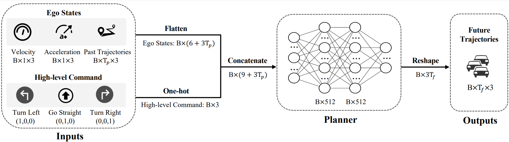

# Rethinking the Open-Loop Evaluation of End-to-End Autonomous Driving in nuScenes

[](https://paperswithcode.com/sota/trajectory-planning-on-nuscenes?p=rethinking-the-open-loop-evaluation-of-end-to)

This repository is an official implementation of the technical report [AD-MLP](https://arxiv.org/pdf/2305.10430.pdf).

<br/>

> Jiang-Tian Zhai\*, Feng Ze\*, Jinhao Du\*, Yongqiang Mao\*, Jiang-Jiang Liu&#8224;, Zichang Tan, Yifu Zhang, Xiaoqing Ye, Jingdong Wang&#8224;
> 
> Baidu Inc.
>
> \*: equal contribution, <sup>&#8224;</sup>: corresponding author.
>

## News
* 2023.05.18: Paper is released on [arxiv](https://arxiv.org/pdf/2305.10430.pdf)!
* 2023.05.17: Code / Models are released!

## Introduction

<div align="center">

</div>


### Interesting Tips!

- We use a simple MLP-based approach that takes raw sensor data as input and outputs the future trajectory planning of the ego vehicle, without using any perception or prediction information such as camera images or LiDAR. This simple method achieves state-of-the-art end-to-end planning performance on the nuScenes Dataset, reducing the average L2 error by about 20\% on the nuScenes open-loop evaluation metrics.
- The primary objective of this work is to present our observations **rather than** to propose a new method.
- Our findings demonstrate the potential limitations of the current evaluation scheme on the nuScenes dataset.
- Although our model performs well within the confines of the nuScenes Dataset, we acknowledge that it is merely an impractical toy incapable of functioning in real-world scenarios. Driving without any perception surrounding knowledge beyond the ego vehicle’s states is an insurmountable challenge. 
- We hope our findings will stimulate further research in the field, encouraging a re-evaluation and enhancement of the planning task for end-to-end autonomous driving.

## Results
- Open-loop planning results on [nuScenes](https://github.com/nutonomy/nuscenes-devkit). 

| Method | L2 (m) 1s $\downarrow$ | L2 (m) 2s $\downarrow$ | L2 (m) 3s $\downarrow$ | Col. (%) 1s $\downarrow$ | Col. (%) 2s $\downarrow$ | Col. (%) 3s $\downarrow$ |
| :---: | :---: | :---: | :---: | :---:| :---: | :---: |
| ST-P3 | 1.33 | 2.11 | 2.90 | 0.23 | 0.62 | 1.27 |
| UniAD | 0.48 | 0.96 | 1.65 | **0.05** | 0.17 | 0.71 |
| VAD-Tiny | 0.20 | 0.38 | 0.65 | 0.10 | 0.12 | 0.27 |
| VAD-Base | **0.17** | 0.34 | 0.60 | **0.07** | **0.10** | **0.24** |
| Ours | **0.17** | **0.28** | **0.41** | 0.14 | 0.18 | 0.25 |

## Get Started

* Environment
  Linux, Python==3.7.9, CUDA == 11.2, pytorch == 1.9.1 or paddlepaddle == 2.3.2. Besides, follow instruction in ST-P3 for running its evaluation process.
  ```
  cd deps/stp3
  conda env create -f environment.yml
  ```

* Prepare Data   
Download the [nuScenes](https://www.nuscenes.org/download) Dataset.

* Pretrained weights   
To verify the performance on the nuScenes Dataset, we provide the pretrained model weights ([Google Drive](https://drive.google.com/drive/folders/1CJa54-Ft8qakR4EyRtxvswQxT1dgPB_9) and [Baidu Netdisk](https://pan.baidu.com/s/1cEDETxG-HHwyC7ATBk_hyQ?pwd=9fbf)). Please download them (paddle checkpoint, token of validation set...) to the root directory of this project.

* Paddle Evaluation   
  ```
  python paddle/model/AD-MLP.py
  python deps/stp3/evaluate_for_mlp.py
  ```
  The first line saves the predicted 6 frames' trajectories of the next 3s in output_data.pkl. And the second line applies the ST-P3 evaluation on it. The final evaluation output contains the L2 error and collision rate in the next 1, 2 and 3s.
  
  Two versions of evaluation metrics are provided: online and offline. The offline version uses pre-stored ground truth and is far faster than online one. The code defaults to offline.

* Training:
The code we use for training the model is located in the [Baidu Netdisk](https://pan.baidu.com/s/1IjN2pUUB35k2ScOitVsuGA?pwd=t4br). To use it, you need to refer to https://github.com/mit-han-lab/bevfusion to configure the nuscenes dataset and the environment. Start the training process with r1.py under the folder:
  python train.py
  ```
For convinience, we also upload the training code in pytorch/ folder, and you can download some necessary pkl files from the Baidu Netdisk link provided above to start training.
* Collision rate evaluation:
We have observed that the evaluation of model collision rates is sensitive to certain samples. One typical example is when the ego vehicle is in a stationary state, the model often predicts trajectories for the next 3 seconds that are very close to the origin (but not exactly 0). If obstacles exist in the range of [0, 0.5m) in the x,y dimensiosn around the origin, the model's predictions of coordinates with very small absolute values can introduce unstable systematic errors due to the resolution of the occupancy map. To mitigate this issue, we recommend processing the model outputs in the deps/stp3/evaluate_for_mlp.py or at the original model inference stage. For instance, you can set the model's predicted trajectory to zero if the distance from the origin is smaller than a little threshold, e.g. 1e-2m. This approach is similar to the filtering of ground truth trajectories that collide in the original evaluation code, as both methods aim to remove systematic errors. We also suggest reviewing cases where collisions occur.

## Contact
If you have any questions or suggestions about this repo, please feel free to contact us (jtzhai30@gmail.com, j04.liu@gmail.com, yxq@whu.edu.cn, wangjingdong@outlook.com).

## Acknowledgement
This repo is build based on [ST-P3](https://github.com/OpenPerceptionX/ST-P3). Thanks for their great work.

## License
All code in this repository is under the [Apache License 2.0](https://www.apache.org/licenses/LICENSE-2.0).

### BibTeX

If you find our work and this repository useful. Please consider giving a star and citation.

```bibtex
@article{zhai2023ADMLP,
  title={Rethinking the Open-Loop Evaluation of End-to-End Autonomous Driving in nuScenes},
  author={Zhai, Jiang-Tian and Feng, Ze and Du, Jihao and Mao, Yongqiang and Liu, Jiang-Jiang and Tan, Zichang and Zhang, Yifu and Ye, Xiaoqing and Wang, Jingdong},
  journal={arXiv preprint arXiv:2305.10430},
  year={2023}
}
```
